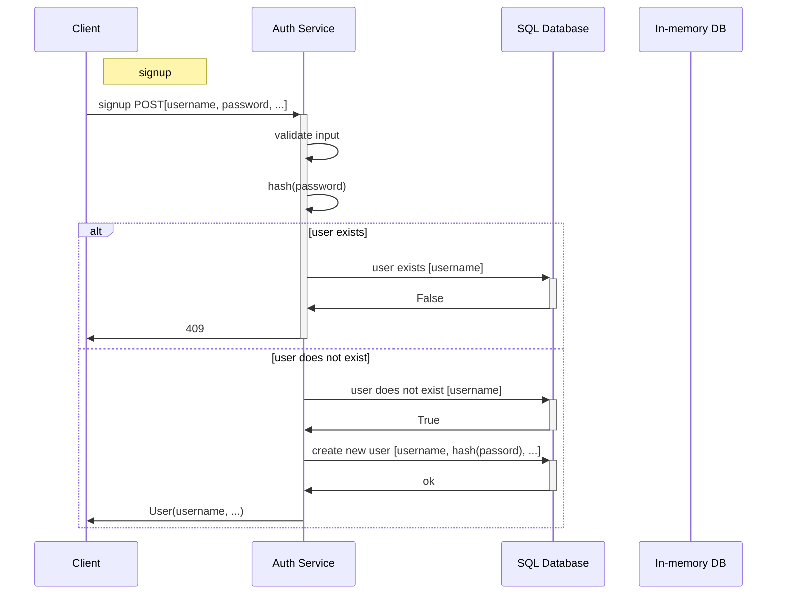
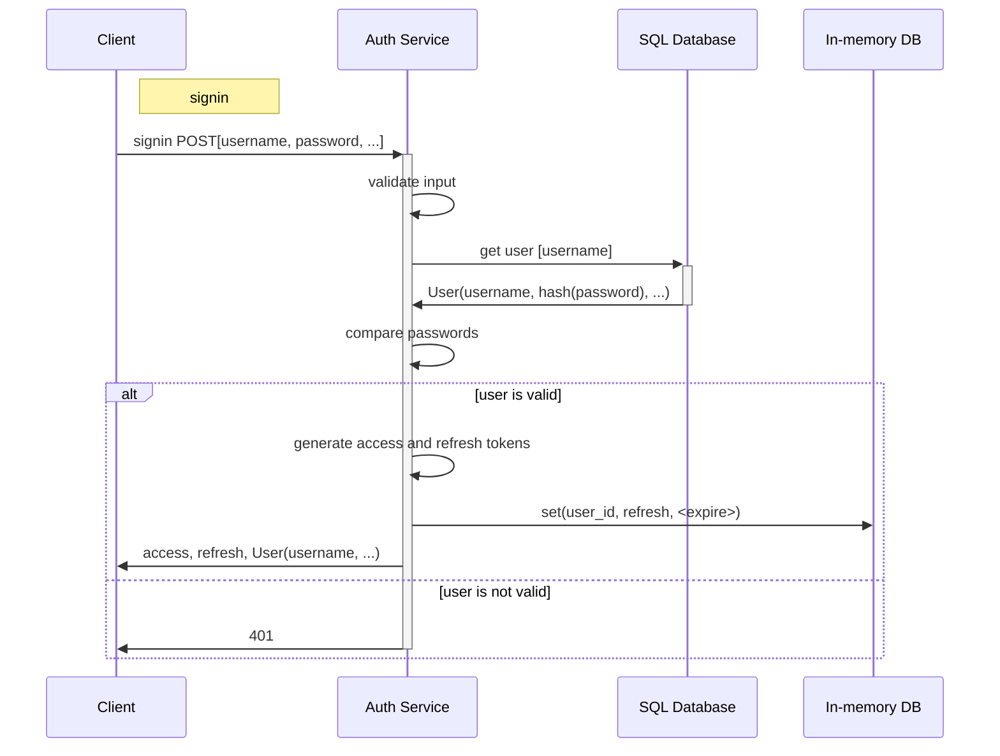
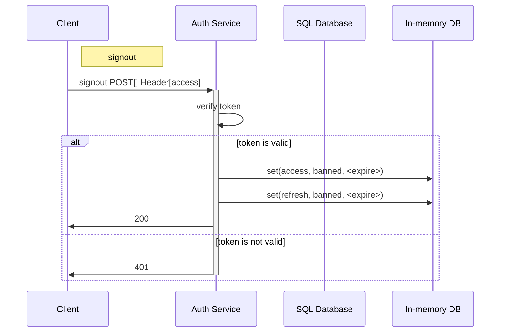
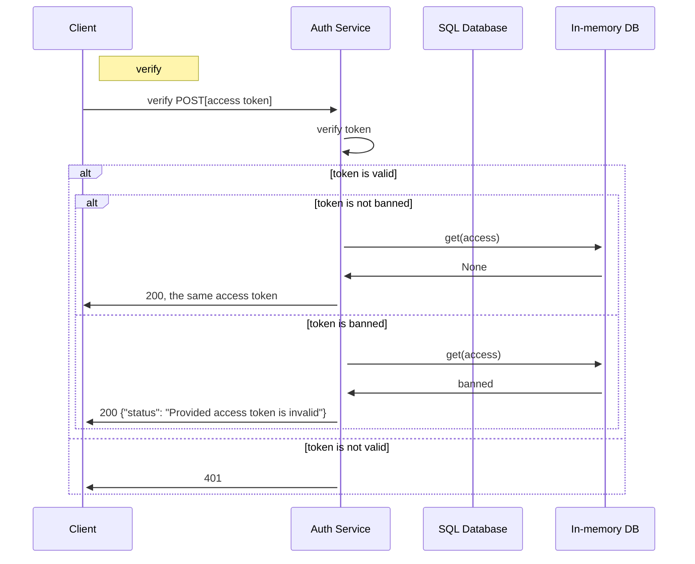
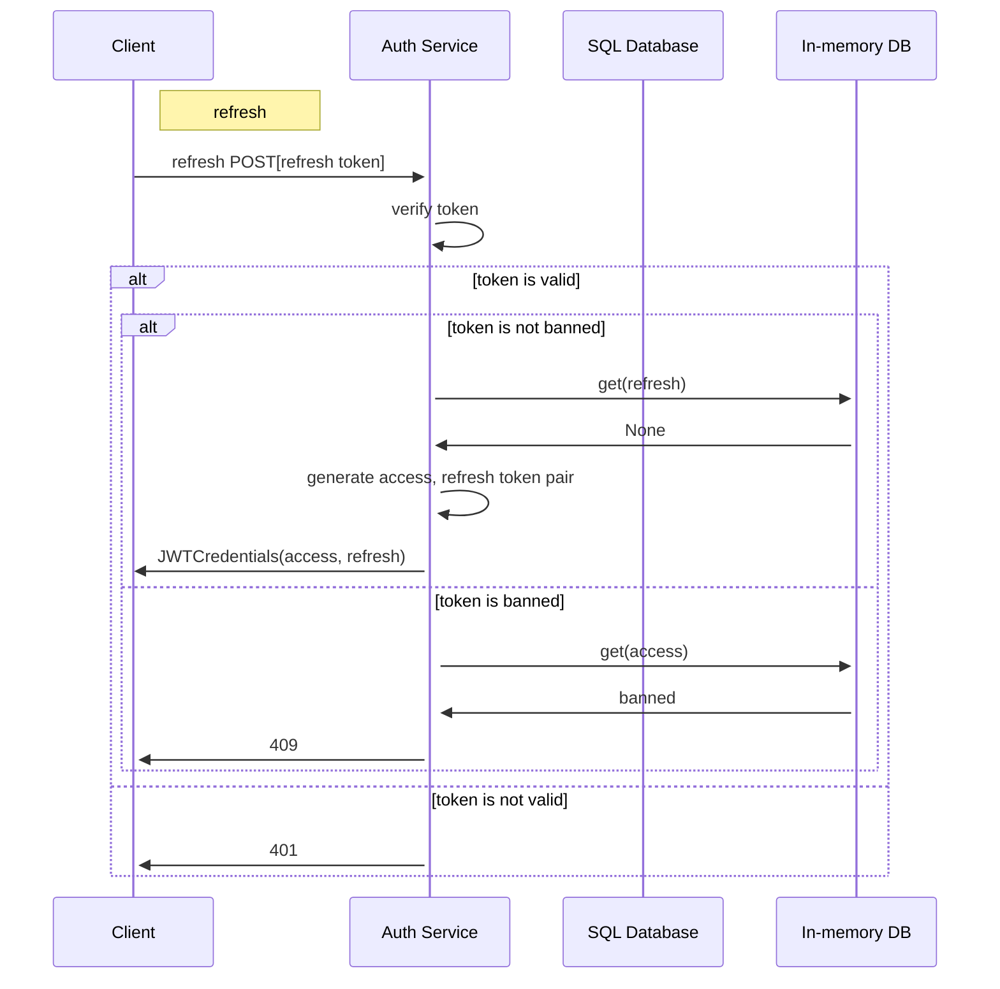
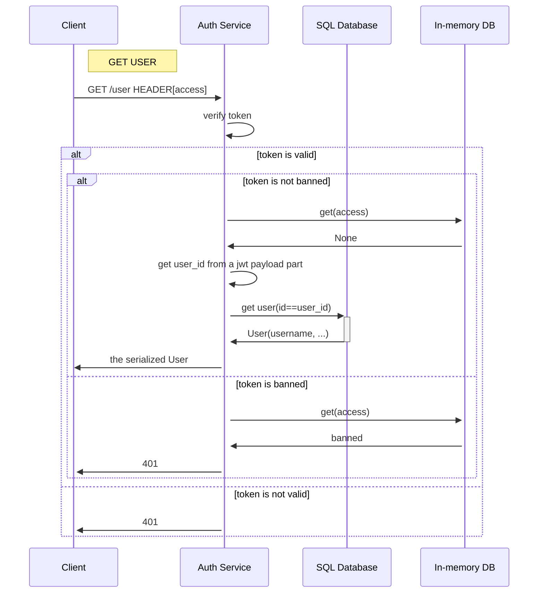
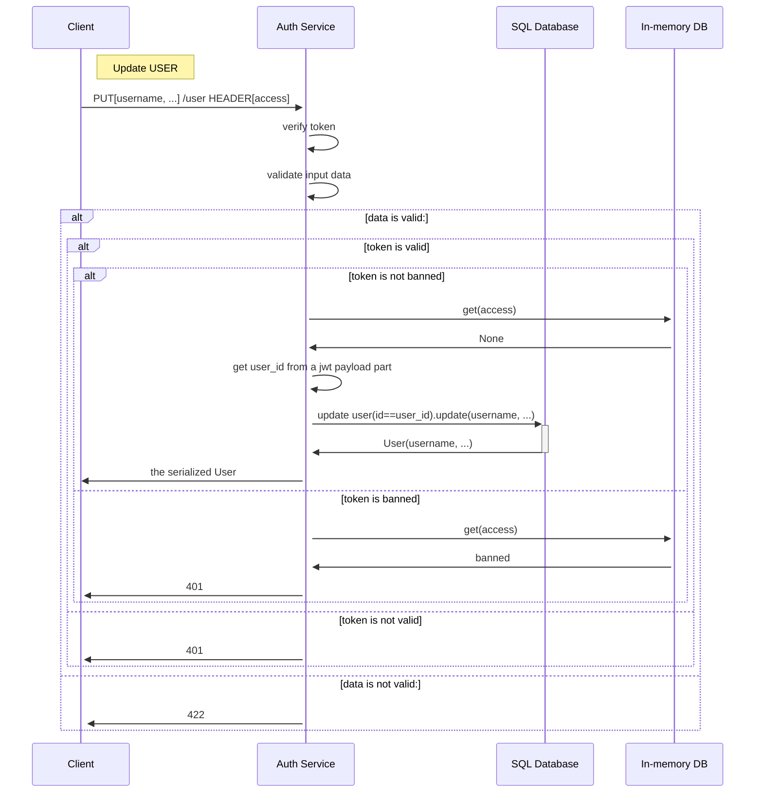
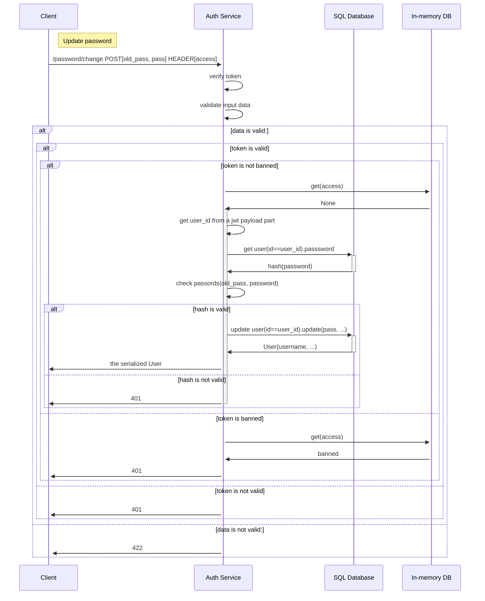

# Auth (Sprint 7)

## Getting started

### Building and running for development

**Steps:**

0. Create `.env` file at the project's root directory and fill it with necessary environment variables.
You can find an example of `.env` file in `.env.example`.

1. Build and run docker container with `dev` env:

 ```commandline
./scripts/dev.sh up -d
 ```

2. Activate virtual environment:

 ```commandline
poetry shell
 ```

3. Run `auth` service locally:

```commandline
uvicorn src.main:app --reload
 ```

or

```commandline
python -m src.main
```

## Running database migrations

NOTE: First run your database inside of docker container

### Apply migrations
```
alembic upgrade head
```

### Create superuser via CLI

To create superuser with all service permissions granted:

```
create-superuser --username superadmin --first-name Jack --last-name Smith
```

## Service documentation

OpenAPI 3 documentation:

- Swagger

    ```
    GET /api/openapi
    ```

- ReDoc

    ```
    GET /redoc
    ```

- OpenAPI json

    ```
    GET /api/openapi.json
    ```

## Service design
### Sequence diagrams
#### Signup

#### Signin

#### Signout


#### Verify

#### Refresh

#### Get user

#### Update user

#### Update password

### Entity diagram
https://dbdiagram.io/d/64a1ad1202bd1c4a5e5f3c99

```
Table users {
  id UUID [primary key]
  username varchar(255)
  password varchar(255)
  first_name varchar(50)
  last_name varchar(50)
  created_at timestamp
  modified_at timestamp

  Indexes {
    (username) [unique]
  }
}

Table roles {
  id UUID [primary key]
  name varchar(50) // superuser, subscriber
  created_at timestamp
  modified_at timestamp

  Indexes {
    (name) [unique]
  }
}

Table users_roles {
  id UUID [primary key]
  user_id UUID
  role_id UUID
  created_at timestamp
  modified_at timestamp

  Indexes {
    (user_id, role_id) [unique]
  }
}

Table permissions {
  id UUID [primary key]
  name varchar(50) // crud_user, comment, like, watch_basic_content, watch_premium_content
  created_at timestamp
  modified_at timestamp

  Indexes {
    (name) [unique]
  }
}

Table roles_permissions {
  id UUID [primary key]
  role_id UUID
  permission_id UUID
  created_at timestamp
  modified_at timestamp

  Indexes {
    (role_id, permission_id) [unique]
  }
}

Table users_login_history {
  id UUID [primary key]
  user_id UUID
  user_agent varchar(255)
  ip_address INET
  created_at timestamp
}

Ref: "users"."id" < "users_roles"."user_id"

Ref: "roles"."id" < "users_roles"."role_id"

Ref: "permissions"."id" < "roles_permissions"."permission_id"

Ref: "roles"."id" < "roles_permissions"."role_id"

Ref: "users"."id" < "users_login_history"."user_id"
```

## Sign in using social accounts

Currently, the service supports sign in using social accounts of the following providers:

- Google
- Yandex

To provide sign in using social accounts, you need to create an application in the developer console of the corresponding provider.

After that, you will receive a `client_id` and a `client_secret`.

- GET `/api/v1/auth/social/login/{provider_slug}` - redirect to the provider's authorization page.
- GET `/api/v1/auth/social/auth/{provider_slug}` - callback url, where the provider will redirect the user after authorization.

_Note: when testing, do not use OpenAPI UI, because it does not support redirects._
